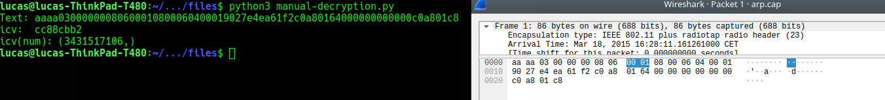

[Livrables](#livrables)

[Échéance](#échéance)

[Travail à réaliser](#travail-à-réaliser)

# Sécurité des réseaux sans fil

## Laboratoire 802.11 Sécurité WEP

__A faire en équipes de deux personnes__

### Pour cette partie pratique, vous devez être capable de :

* Déchiffrer manuellement des trames WEP utilisant Python et Scapy
* Chiffrer manuellement des trames WEP utilisant Python et Scapy
* Forger des fragments protégés avec WEP afin d’obtenir une keystream de longueur plus grande que 8 octets

Vous allez devoir faire des recherches sur internet pour apprendre à utiliser Scapy. __Il est fortement conseillé d'employer une distribution Kali__ (on ne pourra pas assurer le support avec d'autres distributions). 

## Travail à réaliser

### 1. Déchiffrement manuel de WEP

Dans cette partie, vous allez récupérer le script Python [manual-decryption.py](files/manual-decryption.py). Il vous faudra également le fichier de capture [arp.cap](files/arp.cap) contenant un message arp chiffré avec WEP et la librairie [rc4.py](files/rc4.py) pour générer les keystreams indispensables pour chiffrer/déchiffrer WEP. Tous les fichiers doivent être copiés dans le même répertoire local sur vos machines.

- Ouvrir le fichier de capture [arp.cap](files/arp.cap) avec Wireshark
   
- Utiliser Wireshark pour déchiffrer la capture. Pour cela, il faut configurer dans Wireshark la clé de chiffrement/déchiffrement WEP (Dans Wireshark : Preferences&rarr;Protocols&rarr;IEEE 802.11&rarr;Decryption Keys). Il faut également activer le déchiffrement dans la fenêtre IEEE 802.11 (« Enable decryption »). Vous trouverez la clé dans le script Python [manual-decryption.py](files/manual-decryption.py).
   
- Exécuter le script avec `python manual-decryption.py`
   
- Comparer la sortie du script avec la capture text déchiffrée par Wireshark
   

- Analyser le fonctionnement du script

1. Déclaration de la clé WEP de 40 bits
   1. `key= b'\xaa\xaa\xaa\xaa\xaa'`
2. Lecture du message chiffré depuis le fichier .cap
   1. `arp = rdpcap('arp.cap')[0]`
3. Concaténation de la clé WEP (40 bits) et du vecteur d'initialisation (24 bits) pour former le clé RC4 de 64 bits
   1. `seed = arp.iv+key`
4. Récupération de l'ICV chiffré depuis le message chiffré
   1. `icv_encrypted='{:x}'.format(arp.icv)`
5. Composition du texte chiffré composé du texte chiffré suivi de l'ICV chiffré
   1. `message_encrypted=arp.wepdata+bytes.fromhex(icv_encrypted)`
6. Déchiffrement du texte avec RC4
   1. `cipher = RC4(seed, streaming=False)`
   2. `cleartext=cipher.crypt(message_encrypted)`
7. Récupération de l'ICV et du texte clair. L'ICV correspond au 4 octets de poids faibles du texte clair
   1. `icv_enclair=cleartext[-4:]`
   2. `icv_enclair = icv_enclair`
   3. `icv_numerique=struct.unpack('!L', icv_enclair)`
   4. `text_enclair=cleartext[:-4]`
8. Affichage
   1. `print ('Text: ' + text_enclair.hex())`
   2. `print ('icv:  ' + icv_enclair.hex())`
   3. `print ('icv(num): ' + str(icv_numerique))`

### 2. Chiffrement manuel de WEP

Utilisant le script [manual-decryption.py](files/manual-decryption.py) comme guide, créer un nouveau script `manual-encryption.py` capable de chiffrer un message, l’enregistrer dans un fichier pcap et l’envoyer.
Vous devrez donc créer votre message, calculer le contrôle d’intégrité (ICV), et les chiffrer (voir slides du cours pour les détails).

### Quelques éléments à considérer :

- Vous pouvez utiliser la même trame fournie comme « template » pour votre trame forgée (conseillé). Il faudra mettre à jour le champ de données qui transporte le message (`wepdata`) et le contrôle d’intégrite (`icv`).
- Le champ `wepdata` peut accepter des données en format text mais il est fortement conseillé de passer des bytes afin d'éviter les soucis de conversions.
- Le champ `icv` accepte des données en format « long ».
- Vous pouvez vous guider à partir du script fourni pour les différentes conversions de formats qui pourraient être nécessaires.
- Vous pouvez exporter votre nouvelle trame en format pcap utilisant Scapy et ensuite, l’importer dans Wireshark. Si Wireshark est capable de déchiffrer votre trame forgée, elle est correcte !

### 3. Fragmentation

Dans cette partie, vous allez enrichir votre script développé dans la partie précédente pour chiffrer 3 fragments.

### Quelques éléments à considérer :

- Chaque fragment est numéroté. La première trame d’une suite de fragments a toujours le numéro de fragment à 0. Une trame entière (sans fragmentation) comporte aussi le numéro de fragment égal à 0
- Pour incrémenter le compteur de fragments, vous pouvez utiliser le champ « SC » de la trame. Par exemple : `trame.SC += 1`
- Tous les fragments sauf le dernier ont le bit `more fragments` à 1, pour indiquer qu’un nouveau fragment va être reçu
- Le champ qui contient le bit « more fragments » est disponible en Scapy dans le champ `FCfield`. Il faudra donc manipuler ce champ pour vos fragments. Ce même champ est visible dans Wireshark dans IEEE 802.11 Data &rarr; Frame Control Field &rarr; Flags
- Pour vérifier que cette partie fonctionne, vous pouvez importer vos fragments dans Wireshark, qui doit être capable de les recomposer
- Pour un test encore plus intéressant (optionnel), vous pouvez utiliser un AP (disponible sur demande) et envoyer vos fragments. Pour que l’AP accepte vous données injectées, il faudra faire une « fake authentication » que vous pouvez faire avec `aireplay-ng`
- Si l’AP accepte vos fragments, il les recomposera et les retransmettra en une seule trame non-fragmentée !

## Livrables

Un fork du repo original . Puis, un Pull Request contenant :

-	Script de chiffrement WEP **abondamment commenté/documenté**
  - Fichier pcap généré par votre script contenant la trame chiffrée
  - Capture d’écran de votre trame importée et déchiffré par Wireshark
-	Script de fragmentation **abondamment commenté/documenté**
  - Fichier pcap généré par votre script contenant les fragments
  - Capture d’écran de vos trames importées et déchiffrés par Wireshark 

-	Envoyer le hash du commit et votre username GitHub par email au professeur et à l'assistant

## Échéance

Le 14 avril 2022 à 23h59
